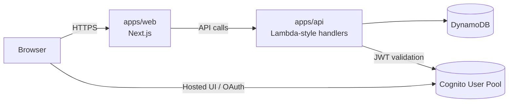

# BuildrLab Community SaaS

<!-- Update badge URLs if you fork this repo. -->
[](https://github.com/buildrlab/buildr-community-saas/actions/workflows/ci.yml)
[](./LICENSE)
[](https://nextjs.org/)
[](https://pnpm.io/)

Opinionated, production-lean starter for a **multi-tenant SaaS** with:

- **Web**: Next.js 16 (React 19, Tailwind v4)
- **API**: AWS Lambda-style handlers (Node.js 20) + local dev server
- **Data**: DynamoDB (single-table friendly)
- **Auth**: Cognito (JWT validation) with a safe local *test-mode* bypass
- **Infra**: Terraform modules + dev/prod envs
- **Tooling**: pnpm workspaces, TypeScript strict, ESLint, Prettier, Vitest, Playwright

This repo is designed so someone can clone it and be productive quickly:

```bash
pnpm i
pnpm dev
```

---

## What's included

- Next.js 16 App Router app (React 19, Tailwind v4)
- Lambda-style API handlers with a local dev server
- DynamoDB single-table friendly data model utilities
- Cognito JWT verification with optional local test-mode
- Terraform modules for dev/prod environments
- CI checks for lint, typecheck, tests, and builds
- Vitest + Playwright testing setup

---

## Architecture



See `docs/ARCHITECTURE.md` for a deeper walkthrough.

---

## Monorepo layout

This monorepo separates deployable apps from shared packages and infrastructure:

```
.
|- apps/
|  |- web/        # Next.js app (frontend)
|  `- api/        # Lambda-style handlers + local dev server
|- packages/
|  `- shared/     # Shared utilities/types
|- infra/         # Terraform modules + envs
`- assets/        # Brand assets
```

- `apps/web` - Next.js app
- `apps/api` - API handlers + local dev server (simulates Lambda/API Gateway)
- `packages/shared` - Shared utilities/types
- `infra/` - Terraform modules + envs
- `assets/` - Brand assets

---

## Prerequisites

- **Node.js**: 20+ (works with newer Node too)
- **pnpm**: `9.x` (see root `package.json#packageManager`)

Optional (for E2E):

- Playwright browsers: `pnpm --filter @buildrlab/web exec playwright install --with-deps`

---

## Quickstart (local dev)

### 1) Install

```bash
pnpm install
```

### 2) Configure environment

Copy the example env files:

```bash
cp apps/api/.env.example apps/api/.env
cp apps/web/.env.example apps/web/.env.local
```

Common local values:

- `apps/web/.env.local`
  - `NEXT_PUBLIC_API_URL=http://localhost:3001`
  - `NEXT_PUBLIC_TEST_MODE=true` (optional)
  - `NEXT_PUBLIC_TEST_USER=dev-user` (optional)
- `apps/api/.env`
  - `AWS_REGION=us-east-1`
  - `DDB_TABLE_NAME=buildrlab-main`
  - `ALLOW_TEST_MODE=true` (optional)
  - `TEST_USER=dev-user` (optional)

> Note: **test-mode** is intended for local/dev only. In real environments, keep it disabled and use Cognito.

### 3) Run dev servers

From the repo root:

```bash
pnpm dev
```

This starts:

- Web: http://localhost:3000
- API: http://localhost:3001

---

## Environment variables

### apps/web

| Variable | Required | Default/Example | Notes |
| --- | --- | --- | --- |
| `NEXT_PUBLIC_API_URL` | Yes | `http://localhost:3001` | Base URL for the API. |
| `NEXT_PUBLIC_TEST_MODE` | No | `false` | Enables local test-mode; keep `false` in production. |
| `NEXT_PUBLIC_TEST_USER` | No | `dev-user` | Used when test-mode is enabled. |
| `NEXT_PUBLIC_COGNITO_HOSTED_UI_URL` | Prod/Auth | (empty) | Cognito Hosted UI entry point for auth flows. |

### apps/api

| Variable | Required | Default/Example | Notes |
| --- | --- | --- | --- |
| `AWS_REGION` | Yes | `us-east-1` | AWS region for DynamoDB and Cognito. |
| `DDB_TABLE_NAME` | Yes | `buildrlab-main` | DynamoDB table name. |
| `COGNITO_USER_POOL_ID` | Prod/Auth | `us-east-1_example` | User Pool ID for JWT validation. |
| `COGNITO_ISSUER` | Prod/Auth | `https://cognito-idp.us-east-1.amazonaws.com/us-east-1_example` | Issuer used to validate tokens. |
| `COGNITO_JWKS_URI` | Prod/Auth | `https://cognito-idp.us-east-1.amazonaws.com/us-east-1_example/.well-known/jwks.json` | JWKS endpoint for token verification. |
| `ALLOW_TEST_MODE` | No | `false` | Enables local test-mode; keep `false` in production. |
| `TEST_USER` | No | `dev-user` | Used when test-mode is enabled. |

---

## Scripts

At the repo root:

- `pnpm lint` - ESLint across workspaces
- `pnpm typecheck` - TypeScript checks (includes a topological build)
- `pnpm test` - Vitest unit tests across workspaces
- `pnpm build` - Production builds (Next.js + tsup)

Web-only:

- `pnpm --filter @buildrlab/web test:e2e` - Playwright E2E (see `apps/web/e2e/`)

---

## API notes

The API is written in a Lambda-friendly style (small handlers that return `{ statusCode, body }`).

For local development, `apps/api` includes a lightweight dev server that routes requests to handlers.

---

## Infrastructure (Terraform)

Terraform code lives in `infra/`:

- `infra/modules/*` - reusable modules
- `infra/envs/dev` and `infra/envs/prod` - environment compositions

This repo intentionally keeps infra setup minimal and modular; extend it to match your AWS org layout (accounts, OIDC, pipelines, etc.).

---

## Contributing

See [CONTRIBUTING.md](./CONTRIBUTING.md).

---

## License

MIT - see [LICENSE](./LICENSE).
