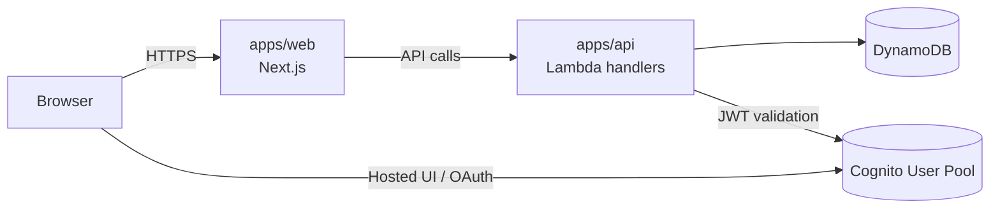

# Architecture

## Monorepo structure

| Path | Purpose |
| --- | --- |
| `apps/web` | Next.js frontend (App Router) |
| `apps/api` | Lambda-style handlers + local dev server |
| `packages/shared` | Shared types/utilities |
| `infra/modules` | Terraform modules for API, auth, DynamoDB, and web |
| `infra/envs/*` | Dev/prod environment composition |

## Runtime flow

## Auth flow (Cognito)

1. User authenticates with Cognito (Hosted UI or your chosen OAuth flow).
2. The frontend sends a JWT access token to the API in the `Authorization` header.
3. The API validates tokens using Cognito issuer/JWKS configuration.
4. For local development only, test-mode can bypass auth when explicitly enabled.

## Local dev vs production

**Local dev**
- `pnpm dev` runs `apps/web` (port 3000) and the API dev server (port 3001).
- Env values come from `apps/web/.env.local` and `apps/api/.env`.
- `NEXT_PUBLIC_TEST_MODE` and `ALLOW_TEST_MODE` can be enabled for local auth bypass.

**Production**
- `apps/api` handlers are packaged as AWS Lambda functions behind API Gateway.
- `apps/web` is built and deployed via Terraform modules (see `infra/modules/web`).
- Cognito provides JWTs; test-mode must remain disabled.
- DynamoDB is the primary data store for tenant data.
